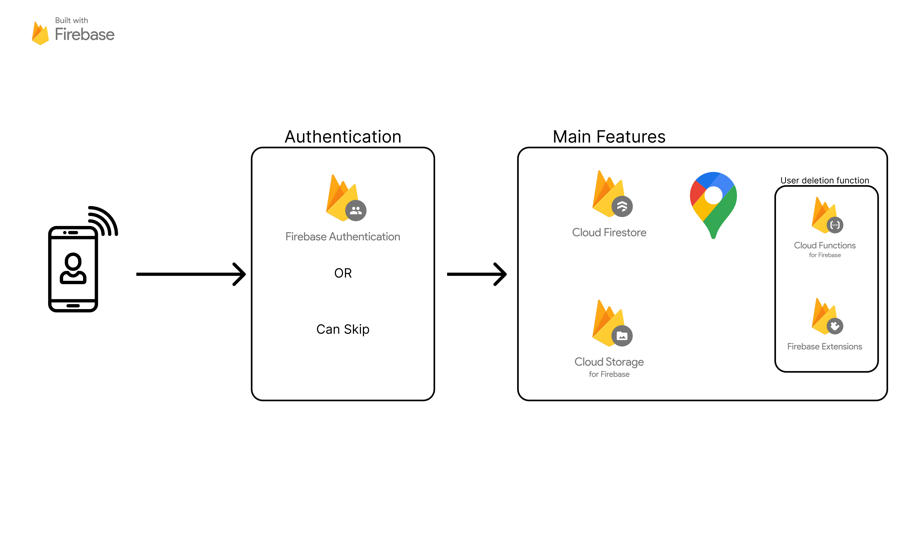

<!--  -->

# Restin

Restin とは、休憩場所を手軽に見つけられる SNS のようなマップアプリケーションです🗾

 

  
  

  

 

 
 

## 📷 画像 / Images

 
 

## ⚙️ 主要機能 / Main Features

全ユーザーが単一のマップ上にマーカーを追加することができます。

ローンチ画面（初期画面）

- 利用規約の確認モーダル
- ログインページへの遷移
- ログインのスキップ

 
 

ログイン画面

- ログイン機能
- 新規登録画面への遷移
- パスワードのリセット画面への遷移

 
 

ホーム画面（マップ画面）

- マーカーを選択し、詳細画面を表示
- 検索バーから、マーカーを検索
- マップの上に重なったボタンを押すことで
  - 地図の種類を切り替え
  - 自分の座標にカメラリセット
  - マーカー作成

 
 

マーカー詳細画面

- マーカーの詳細を表示
- コメント機能
- 保存機能
- 報告機能
- 作成者のプロフィール画面に遷移

 
 

プロフィール画面

- ユーザープロフィール情報を表示
- 自分のプロフィール画面の場合
  - プロフィール編集画面への遷移
  - 自分が投稿したマーカー一覧
  - 自分が保存したマーカー一覧
  - 設定画面への遷移
- 他人のプロフィール画面の場合
  - その人が投稿したマーカー一覧
  - その人が保存したマーカー一覧
  - ブロック機能

 
 

設定画面

- 利用規約画面への遷移
- プライバシーポリシー画面への遷移
- ログイン済みの場合
  - ログアウト機能
  - アカウント削除機能
- 未ログインの場合
  - ログイン画面への遷移

 
 

## 📲 追加予定の機能 / Features to be added

<ul>
<li><input type="checkbox">チュートリアル画面</li>
<li><input type="checkbox">マーカーの編集・削除機能</li>
<li><input type="checkbox">コメントの削除機能</li>
<li><input type="checkbox">マーカーの位置に人がすでにいるか閲覧できる機能（休憩場所が使用中かどうか）</li>
</ul>

 
 

## ⭐️ こだわった部分 / The part I was particular about

`1. 初期画面で認証をスキップできる点`

ログインという工程があることでの離脱率を避けるためにスキップできる機能を追加しました。

 

`2. 新規登録の手順の長さを分かりやすくした点`

各工程で図を設けることで、あと何段階工程があるのかをわかりやすくすることで UX を向上しました。
詳しい画像は遷移図を参照してください。

 

`3.マーカー作成時に立てたい場所のプレビューを同じ画面で表示した点`

マーカーの詳細情報を入力する際に、前の画面でどこにマーカーを立てたか見に戻りたいけど、手間がかかるという不満を解消するために工夫しました。
詳しい画像は遷移図を参照してください。

 

`4.重要なアクションをする際に確認モーダルを表示した点`

マーカーを作成する際、マーカーの作成をキャンセルする際、ログアウトする際、アカウント削除をする際など。

ボタンを押すだけでトリガーすると、予期せぬアクションが起こってしまうため、UX の観点で追加いたしました。
詳しい画像は遷移図を参照してください。

 

`5.アクション後にしっかりとエラーハンドリングをし、SnackBarを表示した点`

ログイン時に全てのエラーをまとめるのではなく、「パスワードは半角英数字を組み合わせてください」や「メールアドレスの形式が正しくありません」など、一つ一つ丁寧に表示することで、ユーザーの理解が追いつき、離脱率の低下に繋げられると思いました。

 

## 📄 遷移図 / Transition Diagram

 
 

## 📈 構成図 / Configuration Diagram

 
 

## 詳細な使用技術 / Detailed usage techniques

#### 位置情報

- geolocator
- google_maps_flutter

#### 状態管理

- flutter_hooks
- hooks_riverpod

#### データ保存

ローカル

- flutter_config
- flutter_dotenv
- shared_preferences

クラウド

- cloud_firestore
- firebase_storage

#### 認証関連

- app_tracking_transparency
- firebase_auth

#### データ処理関連

- cached_network_image
- freezed
- freezed_annotation
- image_picker
- intl
- json_annotation
- uuid
- tuple

#### UI 関連

- flutter_native_splash
- flutter_spinkit
- google_fonts
- material_floating_search_bar_2
- gap

#### ビルド関連

- build_runner
- cider
- flutter_gen_runner
- json_serializable

#### リンター

- pedantic_mono
